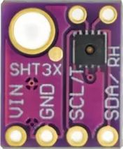
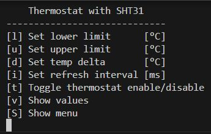
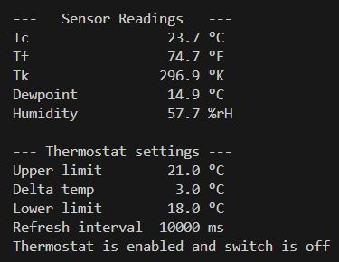

## Universal Thermostat with SHT31 Sensor
In this program, the universal thermostat is operated with a SHT31 sensor 
instead of the NTC sensor.

It measures

- Temperature in °C, °F, °K
- realtive Humidity in %

and calculates the dew point in °C.

|Command Line Interface|Output|
|:--------------------:|:----:|
|||